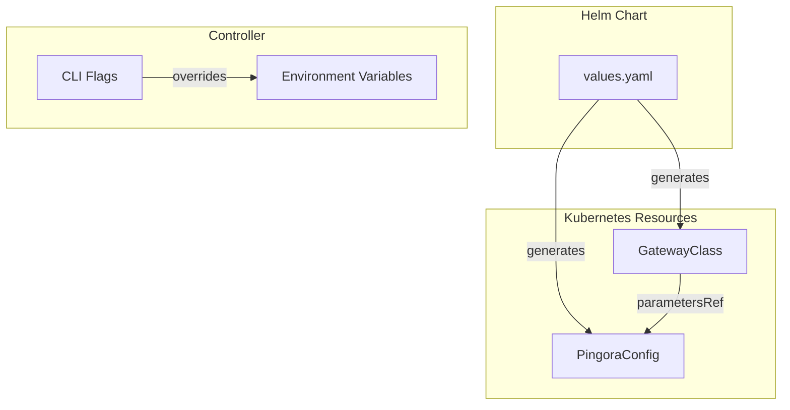

# Configuration

This section covers all configuration options for the Pingora Gateway Controller.

## Overview

Configuration is managed at three levels:

1. **Controller flags** - Runtime behavior (logging, metrics, leader election)
2. **Helm values** - Deployment configuration (replicas, resources, images)
3. **PingoraConfig CRD** - Pingora proxy connection settings

## Sections

-   :material-console:{ .lg .middle } **Controller Options**

    ---

    CLI flags and environment variables for controller configuration.

    [:octicons-arrow-right-24: Controller Options](controller.md)

-   :material-file-cog:{ .lg .middle } **Helm Values**

    ---

    Complete reference for Helm chart values and customization.

    [:octicons-arrow-right-24: Helm Values](helm-values.md)

-   :material-connection:{ .lg .middle } **PingoraConfig CRD**

    ---

    Custom resource for configuring Pingora proxy connection.

    [:octicons-arrow-right-24: PingoraConfig](gatewayclassconfig.md)

## Configuration Hierarchy

## Quick Reference

| Configuration | Scope | Reload |
|--------------|-------|--------|
| CLI flags | Controller | Restart required |
| Environment variables | Controller | Restart required |
| Helm values | Deployment | `helm upgrade` |
| PingoraConfig | Proxy connection | Dynamic (watch) |
