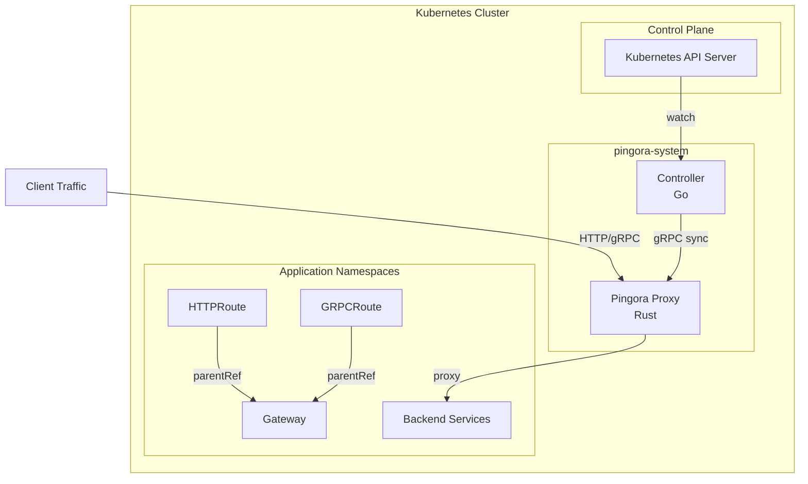
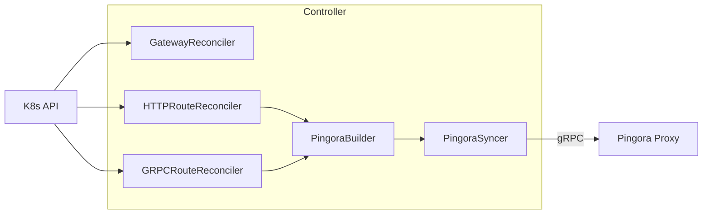
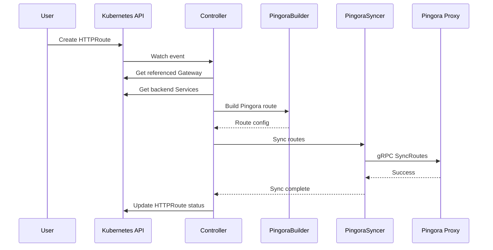
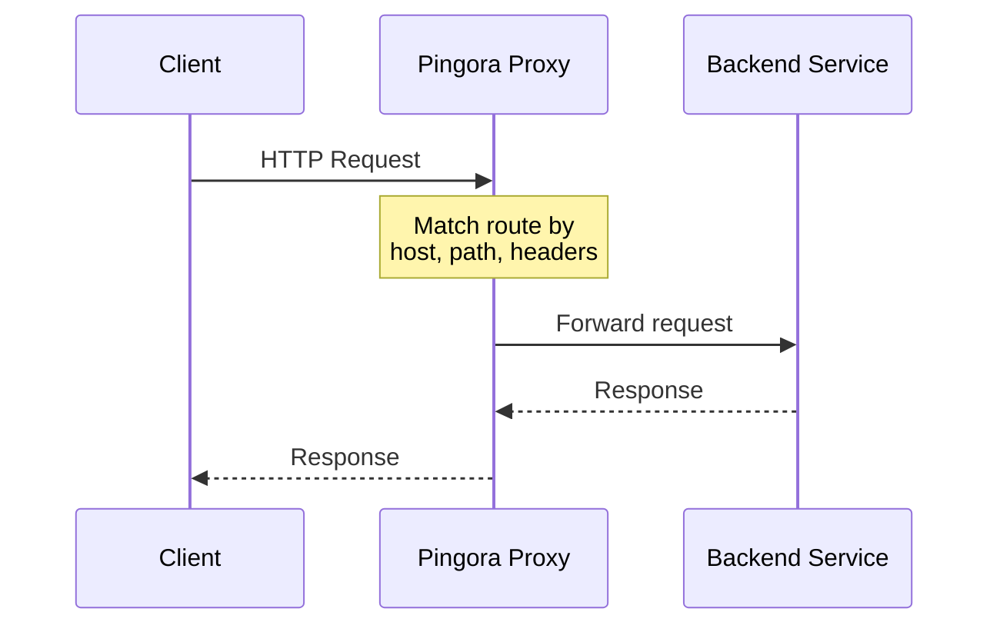
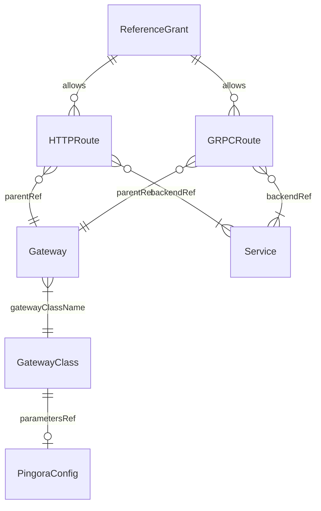
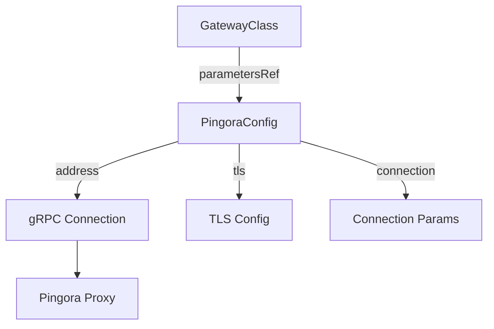

# Architecture

Deep dive into Pingora Gateway Controller architecture and design.

## High-Level Architecture



## Components

### Controller (Go)

The controller is a Kubernetes operator built with controller-runtime:



### Pingora Proxy (Rust)

The proxy is built on Cloudflare's Pingora framework:

- High-performance HTTP/gRPC reverse proxy
- Dynamic configuration via gRPC API
- Zero-downtime route updates

## Controller Components

### GatewayReconciler

Watches Gateway resources and manages their lifecycle:

- Validates GatewayClass reference
- Resolves PingoraConfig from parametersRef
- Updates Gateway status conditions

### HTTPRouteReconciler

Watches HTTPRoute resources:

- Validates parent Gateway references
- Resolves backend Service references
- Triggers route synchronization
- Updates HTTPRoute status

### GRPCRouteReconciler

Similar to HTTPRouteReconciler for GRPCRoute:

- Validates parent Gateway references
- Resolves backend Service references
- Triggers route synchronization
- Updates GRPCRoute status

### PingoraSyncer

Manages communication with Pingora proxy:

- Establishes gRPC connection
- Converts routes to protobuf format
- Sends configuration updates
- Handles connection retry logic

### PingoraBuilder

Converts Gateway API resources to Pingora format:

- Builds route match conditions
- Resolves backend addresses
- Applies timeout configuration

## Data Flow

### Route Configuration Flow



### Request Flow



## Resource Relationships



## Key Design Decisions

### Why gRPC for Controller-Proxy Communication?

- Efficient binary protocol
- Strong typing with protobuf
- Bi-directional streaming capability
- Built-in health checking

### Why Separate Controller and Proxy?

- Independent scaling
- Language-specific optimization (Go for K8s, Rust for performance)
- Independent deployment lifecycle
- Clear separation of concerns

### Why controller-runtime?

- Battle-tested Kubernetes controller framework
- Built-in leader election
- Efficient watch caching
- Standardized patterns

## Package Structure

```text
internal/
├── config/
│   └── pingora_resolver.go    # PingoraConfig resolution
├── controller/
│   ├── gateway_controller.go  # Gateway reconciler
│   ├── httproute_controller.go # HTTPRoute reconciler
│   ├── grpcroute_controller.go # GRPCRoute reconciler
│   └── pingora_syncer.go      # gRPC sync logic
├── dns/
│   └── detect.go              # Cluster domain detection
├── ingress/
│   └── pingora_builder.go     # Route conversion
└── metrics/
    └── metrics.go             # Prometheus metrics
```

## Configuration Flow



## Error Handling

### Retry Strategy

- gRPC connection: Exponential backoff with jitter
- Failed syncs: Immediate retry with rate limiting
- Transient errors: Automatic retry via controller-runtime

### Status Reporting

- Gateway conditions: Accepted, Programmed
- Route conditions: Accepted, ResolvedRefs
- PingoraConfig status: Connected, LastSyncTime

## Next Steps

- Read [Contributing Guidelines](contributing.md)
- Learn about [Testing](testing.md)
