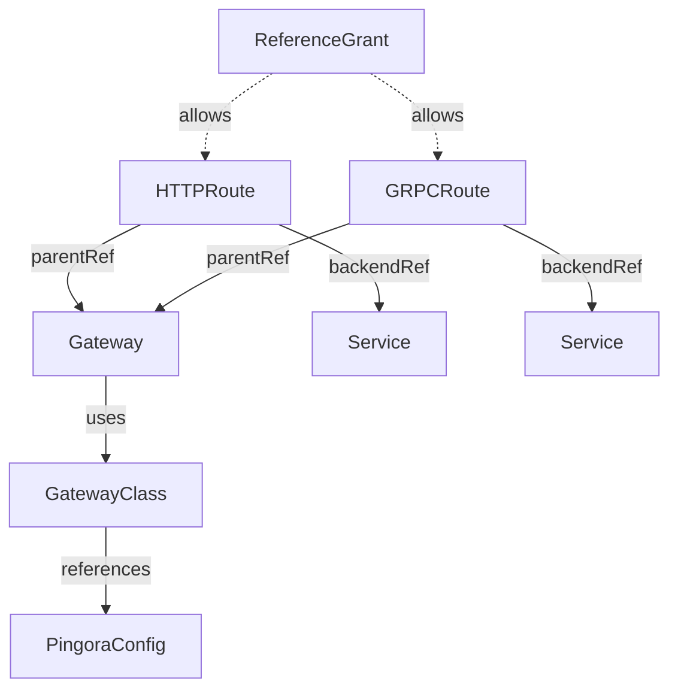

# Gateway API

This section covers the Gateway API resources supported by Pingora Gateway Controller.

## Overview

The controller implements the Kubernetes Gateway API, providing a standardized
way to configure HTTP and gRPC routing through Pingora proxy.

## Sections

<div class="grid cards" markdown>

-   :material-table:{ .lg .middle } **Supported Resources**

    ---

    Compatibility matrix and feature support levels for Gateway API resources.

    [:octicons-arrow-right-24: Supported Resources](supported-resources.md)

-   :material-routes:{ .lg .middle } **HTTPRoute**

    ---

    HTTP routing configuration with path, header, and query parameter matching.

    [:octicons-arrow-right-24: HTTPRoute](httproute.md)

-   :material-protocol:{ .lg .middle } **GRPCRoute**

    ---

    gRPC routing configuration with service and method matching.

    [:octicons-arrow-right-24: GRPCRoute](grpcroute.md)

-   :material-share:{ .lg .middle } **ReferenceGrant**

    ---

    Cross-namespace reference permissions for services and secrets.

    [:octicons-arrow-right-24: ReferenceGrant](referencegrant.md)

-   :material-alert-circle:{ .lg .middle } **Limitations**

    ---

    Current limitations and unsupported features.

    [:octicons-arrow-right-24: Limitations](limitations.md)

</div>

## Quick Example

```yaml
apiVersion: gateway.networking.k8s.io/v1
kind: HTTPRoute
metadata:
  name: example
spec:
  parentRefs:
    - name: pingora-gateway
      namespace: pingora-system
  hostnames:
    - app.example.com
  rules:
    - matches:
        - path:
            type: PathPrefix
            value: /api
      backendRefs:
        - name: api-service
          port: 8080
```

## Resource Hierarchy



## Next Steps

- Review [Supported Resources](supported-resources.md) for compatibility
- Configure [HTTPRoute](httproute.md) for HTTP traffic
- Set up [GRPCRoute](grpcroute.md) for gRPC services
