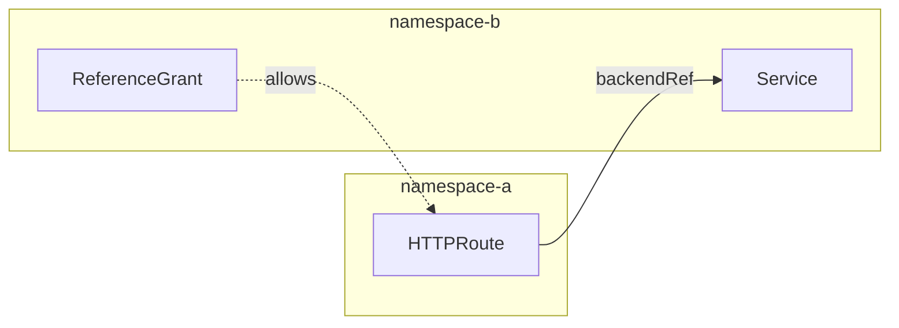

# ReferenceGrant

ReferenceGrant enables cross-namespace references between Gateway API resources.

## Overview

By default, Gateway API resources can only reference resources in the same
namespace. ReferenceGrant allows explicit permission for cross-namespace
references.



## Basic Example

Allow HTTPRoutes from `default` namespace to reference Services in `backend`:

```yaml
apiVersion: gateway.networking.k8s.io/v1beta1
kind: ReferenceGrant
metadata:
  name: allow-default-to-backend
  namespace: backend
spec:
  from:
    - group: gateway.networking.k8s.io
      kind: HTTPRoute
      namespace: default
  to:
    - group: ""
      kind: Service
```

## Use Cases

### Shared Backend Services

Multiple applications routing to a shared service:

```yaml
# In shared-services namespace
apiVersion: gateway.networking.k8s.io/v1beta1
kind: ReferenceGrant
metadata:
  name: allow-app-routes
  namespace: shared-services
spec:
  from:
    - group: gateway.networking.k8s.io
      kind: HTTPRoute
      namespace: app-a
    - group: gateway.networking.k8s.io
      kind: HTTPRoute
      namespace: app-b
  to:
    - group: ""
      kind: Service
```

### Central Gateway

Allow routes from multiple namespaces to use a central Gateway:

```yaml
# In pingora-system namespace
apiVersion: gateway.networking.k8s.io/v1beta1
kind: ReferenceGrant
metadata:
  name: allow-app-routes-to-gateway
  namespace: pingora-system
spec:
  from:
    - group: gateway.networking.k8s.io
      kind: HTTPRoute
      namespace: app-production
    - group: gateway.networking.k8s.io
      kind: HTTPRoute
      namespace: app-staging
  to:
    - group: gateway.networking.k8s.io
      kind: Gateway
```

### GRPCRoute Cross-Namespace

Allow GRPCRoutes to reference services:

```yaml
apiVersion: gateway.networking.k8s.io/v1beta1
kind: ReferenceGrant
metadata:
  name: allow-grpc-routes
  namespace: grpc-services
spec:
  from:
    - group: gateway.networking.k8s.io
      kind: GRPCRoute
      namespace: default
  to:
    - group: ""
      kind: Service
```

## Complete Example

### Namespace Setup

```yaml
# Create namespaces
apiVersion: v1
kind: Namespace
metadata:
  name: frontend
---
apiVersion: v1
kind: Namespace
metadata:
  name: api-backend
```

### Backend Service

```yaml
# In api-backend namespace
apiVersion: v1
kind: Service
metadata:
  name: api-service
  namespace: api-backend
spec:
  ports:
    - port: 8080
  selector:
    app: api
```

### ReferenceGrant

```yaml
# In api-backend namespace
apiVersion: gateway.networking.k8s.io/v1beta1
kind: ReferenceGrant
metadata:
  name: allow-frontend-routes
  namespace: api-backend
spec:
  from:
    - group: gateway.networking.k8s.io
      kind: HTTPRoute
      namespace: frontend
  to:
    - group: ""
      kind: Service
```

### HTTPRoute

```yaml
# In frontend namespace
apiVersion: gateway.networking.k8s.io/v1
kind: HTTPRoute
metadata:
  name: frontend-route
  namespace: frontend
spec:
  parentRefs:
    - name: pingora-gateway
      namespace: pingora-system
  hostnames:
    - app.example.com
  rules:
    - matches:
        - path:
            type: PathPrefix
            value: /api
      backendRefs:
        - name: api-service
          namespace: api-backend
          port: 8080
    - backendRefs:
        - name: frontend-service
          port: 80
```

## Wildcard Namespaces

Allow all namespaces (use with caution):

```yaml
apiVersion: gateway.networking.k8s.io/v1beta1
kind: ReferenceGrant
metadata:
  name: allow-all-namespaces
  namespace: shared-services
spec:
  from:
    - group: gateway.networking.k8s.io
      kind: HTTPRoute
      # Omit namespace to allow all
  to:
    - group: ""
      kind: Service
```

!!! danger "Security Warning"

    Omitting the namespace field allows references from **all** namespaces.
    This should only be used when necessary and with proper consideration.

## Troubleshooting

### Route Not Accepted

Check if ReferenceGrant exists in target namespace:

```bash
kubectl get referencegrant --namespace api-backend
```

### Verify Reference is Allowed

Check HTTPRoute status for reference errors:

```bash
kubectl get httproute frontend-route --namespace frontend --output yaml
```

Look for `ResolvedRefs` condition:

```yaml
status:
  parents:
    - conditions:
        - type: ResolvedRefs
          status: "False"
          reason: RefNotPermitted
          message: "Reference to api-backend/api-service not permitted"
```

### Common Issues

1. **ReferenceGrant in wrong namespace** - Must be in the target namespace
2. **Wrong `from` kind** - Must match the referencing resource type
3. **Missing namespace in `from`** - Required for specific namespace access
4. **Wrong `to` group** - Core resources use empty string `""`

## Security Considerations

- **Principle of least privilege**: Grant only necessary permissions
- **Namespace isolation**: Use specific namespace names, not wildcards
- **Audit ReferenceGrants**: Regularly review cross-namespace permissions
- **RBAC**: Control who can create ReferenceGrants

## Next Steps

- Review [Limitations](limitations.md) for unsupported features
- Set up [Cross-Namespace Routing Guide](../guides/cross-namespace.md)
