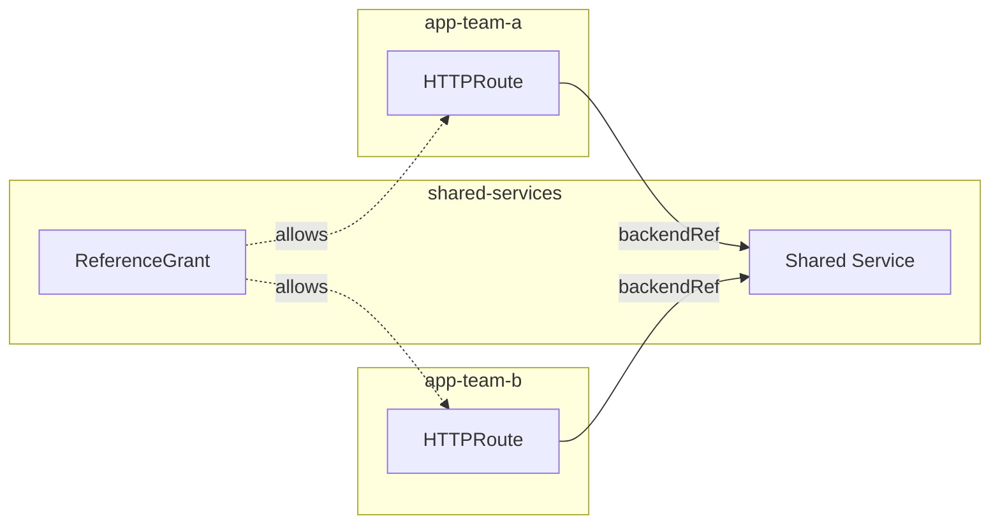
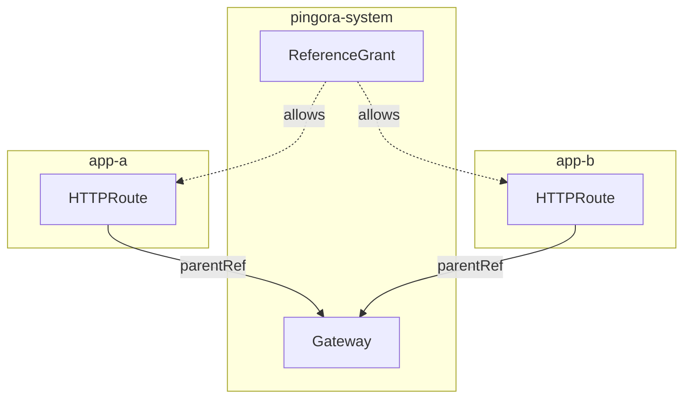

# Cross-Namespace Routing

This guide covers setting up cross-namespace routing for multi-tenant
environments and shared services.

## Overview

By default, HTTPRoute and GRPCRoute can only reference Services in the
same namespace. ReferenceGrant enables cross-namespace references with
explicit permissions.

## Use Cases

### Shared Backend Services

Route traffic from multiple application namespaces to shared services:



### Central Gateway Pattern

Single Gateway serving routes from multiple namespaces:



## Step-by-Step Setup

### 1. Create Namespaces

```bash
kubectl create namespace frontend
kubectl create namespace api-backend
kubectl create namespace shared-services
```

### 2. Deploy Backend Services

```yaml
# In shared-services namespace
apiVersion: apps/v1
kind: Deployment
metadata:
  name: auth-service
  namespace: shared-services
spec:
  replicas: 2
  selector:
    matchLabels:
      app: auth-service
  template:
    metadata:
      labels:
        app: auth-service
    spec:
      containers:
        - name: auth
          image: your-auth-service:latest
          ports:
            - containerPort: 8080
---
apiVersion: v1
kind: Service
metadata:
  name: auth-service
  namespace: shared-services
spec:
  selector:
    app: auth-service
  ports:
    - port: 8080
```

### 3. Create ReferenceGrant

Allow routes from frontend and api-backend to reference shared services:

```yaml
apiVersion: gateway.networking.k8s.io/v1beta1
kind: ReferenceGrant
metadata:
  name: allow-app-routes
  namespace: shared-services
spec:
  from:
    - group: gateway.networking.k8s.io
      kind: HTTPRoute
      namespace: frontend
    - group: gateway.networking.k8s.io
      kind: HTTPRoute
      namespace: api-backend
  to:
    - group: ""
      kind: Service
```

### 4. Create Cross-Namespace HTTPRoute

```yaml
# In frontend namespace
apiVersion: gateway.networking.k8s.io/v1
kind: HTTPRoute
metadata:
  name: frontend-routes
  namespace: frontend
spec:
  parentRefs:
    - name: pingora-gateway
      namespace: pingora-system
  hostnames:
    - app.example.com
  rules:
    # Auth requests go to shared service
    - matches:
        - path:
            type: PathPrefix
            value: /auth
      backendRefs:
        - name: auth-service
          namespace: shared-services
          port: 8080

    # Frontend requests stay in namespace
    - backendRefs:
        - name: frontend-service
          port: 80
```

### 5. Verify Configuration

Check route status:

```bash
kubectl get httproute frontend-routes --namespace frontend --output yaml
```

Look for `ResolvedRefs` condition:

```yaml
status:
  parents:
    - conditions:
        - type: ResolvedRefs
          status: "True"
          reason: ResolvedRefs
```

## Multi-Tenant Pattern

### Tenant Isolation

Each tenant has their own namespace with isolated routes:

```yaml
# Tenant A namespace
apiVersion: v1
kind: Namespace
metadata:
  name: tenant-a
  labels:
    tenant: a
---
# Tenant B namespace
apiVersion: v1
kind: Namespace
metadata:
  name: tenant-b
  labels:
    tenant: b
```

### Central Gateway ReferenceGrant

Allow all tenant namespaces to use the central Gateway:

```yaml
apiVersion: gateway.networking.k8s.io/v1beta1
kind: ReferenceGrant
metadata:
  name: allow-tenant-routes
  namespace: pingora-system
spec:
  from:
    - group: gateway.networking.k8s.io
      kind: HTTPRoute
      namespace: tenant-a
    - group: gateway.networking.k8s.io
      kind: HTTPRoute
      namespace: tenant-b
  to:
    - group: gateway.networking.k8s.io
      kind: Gateway
```

### Tenant Routes

Each tenant manages their own routes:

```yaml
# Tenant A route
apiVersion: gateway.networking.k8s.io/v1
kind: HTTPRoute
metadata:
  name: tenant-a-routes
  namespace: tenant-a
spec:
  parentRefs:
    - name: pingora-gateway
      namespace: pingora-system
  hostnames:
    - tenant-a.example.com
  rules:
    - backendRefs:
        - name: tenant-a-service
          port: 80
```

## RBAC for ReferenceGrant

Control who can create ReferenceGrants:

```yaml
apiVersion: rbac.authorization.k8s.io/v1
kind: Role
metadata:
  name: referencegrant-admin
  namespace: shared-services
rules:
  - apiGroups: ["gateway.networking.k8s.io"]
    resources: ["referencegrants"]
    verbs: ["create", "update", "delete", "get", "list", "watch"]
---
apiVersion: rbac.authorization.k8s.io/v1
kind: RoleBinding
metadata:
  name: platform-team-referencegrant
  namespace: shared-services
subjects:
  - kind: Group
    name: platform-team
    apiGroup: rbac.authorization.k8s.io
roleRef:
  kind: Role
  name: referencegrant-admin
  apiGroup: rbac.authorization.k8s.io
```

## Troubleshooting

### ResolvedRefs Failed

```bash
kubectl get httproute my-route --output jsonpath='{.status.parents[*].conditions}' | jq
```

Common causes:

- ReferenceGrant missing or in wrong namespace
- ReferenceGrant `from` doesn't match route namespace
- ReferenceGrant `to` doesn't match target resource

### Check ReferenceGrants

```bash
# List all ReferenceGrants
kubectl get referencegrant --all-namespaces

# Check specific grant
kubectl describe referencegrant allow-app-routes --namespace shared-services
```

## Best Practices

1. **Least Privilege**: Grant only necessary permissions
2. **Explicit Namespaces**: Always specify namespace in ReferenceGrant
3. **RBAC Control**: Restrict who can create ReferenceGrants
4. **Documentation**: Document cross-namespace dependencies
5. **Monitoring**: Alert on ReferenceGrant changes

## Next Steps

- Set up [Monitoring](monitoring.md) for production
- Review [ReferenceGrant](../gateway-api/referencegrant.md) specification
