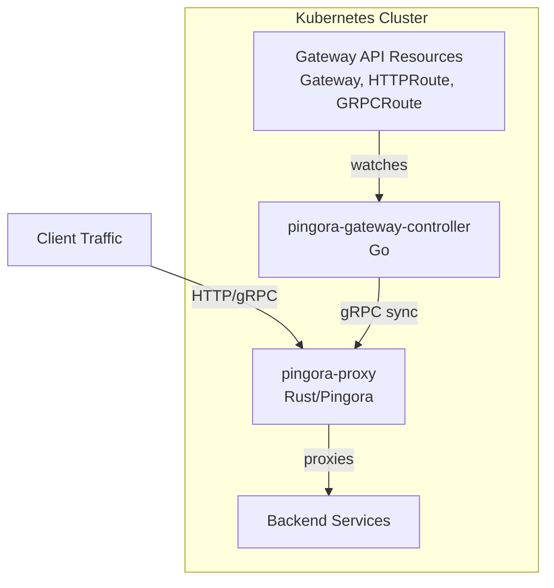

# Pingora Gateway Controller

Kubernetes controller implementing Gateway API for Pingora proxy.

Route traffic through a high-performance Pingora-based reverse proxy using
standard Gateway API resources (Gateway, HTTPRoute, GRPCRoute).

## Architecture



## Features

- **Standard Gateway API** - GatewayClass, Gateway, HTTPRoute, GRPCRoute support
- **High Performance** - Built on [Pingora](https://github.com/cloudflare/pingora), Cloudflare's battle-tested proxy framework
- **Dynamic Configuration** - Routes synced via gRPC without proxy restarts
- **Leader Election** - High availability deployments with multiple replicas
- **Multi-arch Images** - Supports amd64 and arm64 architectures
- **Secure by Default** - Non-root containers, read-only filesystem, minimal capabilities

## Quick Start

```bash
# 1. Install Gateway API CRDs
kubectl apply --filename https://github.com/kubernetes-sigs/gateway-api/releases/download/v1.4.1/standard-install.yaml

# 2. Install the controller with Helm
helm install pingora-gateway-controller \
  oci://ghcr.io/lexfrei/pingora-gateway-controller/chart \
  --namespace pingora-system \
  --create-namespace

# 3. Create HTTPRoute to expose your service
kubectl apply --filename - <<EOF
apiVersion: gateway.networking.k8s.io/v1
kind: HTTPRoute
metadata:
  name: my-app
spec:
  parentRefs:
    - name: pingora-gateway
      namespace: pingora-system
  hostnames:
    - app.example.com
  rules:
    - backendRefs:
        - name: my-service
          port: 80
EOF
```

See [Getting Started](getting-started/index.md) for detailed setup instructions.

## Documentation Sections

| Section | Description |
|---------|-------------|
| [Getting Started](getting-started/index.md) | Prerequisites, installation, and quick start guide |
| [Configuration](configuration/index.md) | Controller options, Helm values, PingoraConfig CRD |
| [Gateway API](gateway-api/index.md) | Supported resources, examples, and limitations |
| [Guides](guides/index.md) | Cross-namespace routing, monitoring setup |
| [Operations](operations/index.md) | Troubleshooting, metrics, and manual installation |
| [Development](development/index.md) | Architecture, contributing, and testing |
| [Reference](reference/index.md) | Helm chart, CRD reference, security |

## Roadmap

Target: **Gateway API v1.4.1 Standard Channel Conformance**

### Milestones

| Version | Status | Description |
|---------|--------|-------------|
| v0.1.0 | :material-clock-outline: Planned | Core Conformance (RequestHeaderModifier, RequestRedirect) |
| v0.2.0 | :material-clock-outline: Planned | Extended Features (ResponseHeaderModifier, URLRewrite, RequestMirror) |
| v0.3.0 | :material-clock-outline: Planned | Gateway API v1.4 (supportedFeatures, BackendTLSPolicy) |
| v0.4.0 | :material-clock-outline: Planned | Conformance Tests & Registration |
| v1.0.0 | :material-clock-outline: Planned | Production-ready with full conformance |

### Gateway API Support

#### Resources

| Resource | Status |
|----------|--------|
| GatewayClass | :material-check-circle: Supported |
| Gateway | :material-check-circle: Supported |
| HTTPRoute | :material-check-circle: Supported |
| GRPCRoute | :material-check-circle: Supported |
| ReferenceGrant | :material-check-circle: Supported |
| BackendTLSPolicy | :material-clock-outline: [Planned](https://github.com/lexfrei/pingora-gateway-controller/issues/30) |

#### HTTPRoute Filters

| Filter | Conformance | Status |
|--------|-------------|--------|
| RequestHeaderModifier | Core | :material-clock-outline: [Planned](https://github.com/lexfrei/pingora-gateway-controller/issues/23) |
| RequestRedirect | Core | :material-clock-outline: [Planned](https://github.com/lexfrei/pingora-gateway-controller/issues/24) |
| ResponseHeaderModifier | Extended | :material-clock-outline: [Planned](https://github.com/lexfrei/pingora-gateway-controller/issues/25) |
| URLRewrite | Extended | :material-clock-outline: [Planned](https://github.com/lexfrei/pingora-gateway-controller/issues/26) |
| RequestMirror | Extended | :material-clock-outline: [Planned](https://github.com/lexfrei/pingora-gateway-controller/issues/27) |

#### HTTPRoute Matching (Implemented)

| Feature | Conformance | Status |
|---------|-------------|--------|
| Path (Exact, Prefix, Regex) | Core | :material-check-circle: Supported |
| Header matching | Core | :material-check-circle: Supported |
| Query parameter matching | Extended | :material-check-circle: Supported |
| Method matching | Extended | :material-check-circle: Supported |
| Backend weight | Core | :material-check-circle: Supported |
| Request timeout | Extended | :material-check-circle: Supported |

See [GitHub Milestones](https://github.com/lexfrei/pingora-gateway-controller/milestones) for detailed progress.

## Project Links

- [GitHub Repository](https://github.com/lexfrei/pingora-gateway-controller)
- [Issues](https://github.com/lexfrei/pingora-gateway-controller/issues)
- [Releases](https://github.com/lexfrei/pingora-gateway-controller/releases)

## License

BSD 3-Clause License - see [LICENSE](https://github.com/lexfrei/pingora-gateway-controller/blob/master/LICENSE)
for details.
